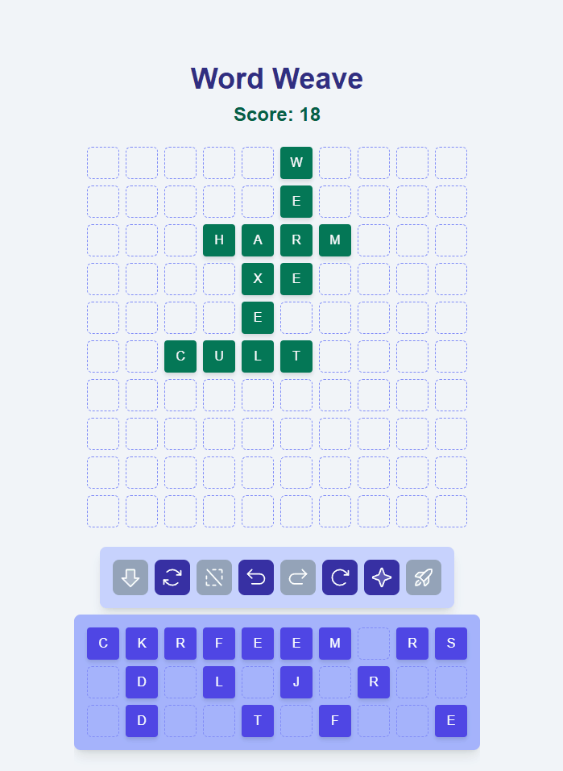

# Word Weave

A daily puzzle app where you make a pattern of letter tiles to make a high scoring set of anagrams

Each day there is a new set of lettered tiles and your job is to weave a pattern of words together on the board. There are only so many letters so make sure you reuse them to get more score out of the same tiles. Try to use all the tiles. There's always a way to use them all, and usually there are many ways. 



## How does it work

The main objects in the game that move around are the tiles. [`Tiles`](./components/game/Tile.tsx) are setup to move towards whatever space they are assigned. So by changing the space that a tile is targeting, the tile will smoothly animate to the new position. Since manipulating the tiles is the main interaction of the game, there are a lot of places in the code that move tiles around. Most of the game buttons do some kind of bulk manipulation of tile movements.

Looking at *Shuffle* as an example. This button randomly mixes around your tiles, hopefully helping you see different patterns in the letters. One thing to note here is that the spaces in the game can be grouped as "board" spaces (where you place tiles for the game) and "panel" spaces (where the tiles start out before you place them). So for this shuffle we know that the panel tiles are the ones that need to be shuffled, and the panel spaces are where they should end up. 

So to make the suffle, we shuffle up the panel spaces and then assign one to each tile until we're out of tiles (the # of panel spaces is always greater or equal to the # of panel tiles). Once the list of movements is made its passed over to moveTiles to actually perform the data change; for shuffle the saveToHistory flag is false so that the undo history doesnt get flouded with shuffles that dont actually change the board state.

*from [`Shuffle.tsx`](./components/game/game-buttons/Shuffle.tsx)*
```tsx
const handleShuffle = () => {
    const panelTiles = tiles.filter(tile => spaces.find(space => space.id === tile.spaceID)?.position.container === "panel")
    let unusedSpaces = shuffleArray(spaces.filter(space => space.position.container === "panel"))

    const movements = panelTiles.map(tile => ({
        id: tile.id,
        spaceID: unusedSpaces.shift()!.id
    }))

    moveTiles(movements, false)
}
```

Once the game is ongoing and there are tilesonthe board, the game needs to give feedback to the player. They need to be able to tell if the words they entered are accepted as part of the solution. One of the more complicated parts of this is checking to see that words are all connected to eachother. 

To make sure all the words in a solution are connected, we start with one word to branch out from. From that word we check each of its neighboring words, that is words that share one of the same tiles. The graphs of words made by the player might have cycles in it, so we need to make sure we dont visit the same word twice.

Since we're checking to make sure the graph the player made is connected, we should deal with the case where its not connected. What if the first word the system check is disconnected but all of the other words are connected? Surely we want the to still show the larger bulk of words as 

*from [`boardSolver.ts`](./app/boardSolver.ts)*
```tsx
const findConnectedWords = (words: WordData[]) => {
    //...
    for (const word of usableWords) {
        if(!visited.has(word.id)){
            // recursively search through every valid word that is connected to this word
            const currentData = connectedWordDFS(word, usableWords, visited, new Set(), 0)
            // update data from DFS return
            if (currentData.score > largestScore){
                largestScore = currentData.score
                largestGraph = currentData.currentGraph
            }
            // if any valid words were not connected/visited, the next loop will DFS on one of those words
        }
    }
    //...
}
const connectedWordDFS = (word: WordData, usableWords: WordData[], visited: Set<number>, currentGraph: Set<number>, score: number) => {
    currentGraph.add(word.id)
    visited.add(word.id)
    score += word.word.length

    // neighboring words will share a tile ID
    const neighbors = usableWords.filter(
        wordObj => wordObj.id != word.id && [...wordObj.tileIDs].some(id => word.tileIDs.has(id))
    )

    // recurse through connected words
    for (const neighbor of neighbors){
        if (!visited.has(neighbor.id)){
            // recursively call on each neighbor and pass the data up through returns
            const result = connectedWordDFS(neighbor, usableWords, visited, currentGraph, score)
            currentGraph = result.currentGraph
            score = result.score
        }
    }

    return {currentGraph, score}
}
```


